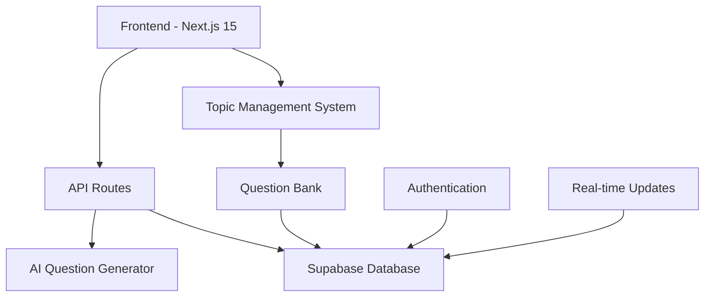

# 🧮 dsemath.ai

<div align="center">

! dsemath.ai Banner](https://img.shields.io/badge/DSE%20Math%20AI-Intelligent%20Math%20Learning-blue?style=for-the-badge&logo=data:image/svg+xml;base64,PHN2ZyB3aWR0aD0iMjQiIGhlaWdodD0iMjQiIHZpZXdCb3g9IjAgMCAyNCAyNCIgZmlsbD0ibm9uZSIgeG1sbnM9Imh0dHA6Ly93d3cudzMub3JnLzIwMDAvc3ZnIj4KPHBhdGggZD0iTTEyIDJMMTMuMDkgOC4yNkwyMCA5TDEzLjA5IDE1Ljc0TDEyIDIyTDEwLjkxIDE1Ljc0TDQgOUwxMC45MSA4LjI2TDEyIDJaIiBmaWxsPSJ3aGl0ZSIvPgo8L3N2Zz4K)

**An intelligent platform for DSE Mathematics practice with AI-powered question generation and comprehensive topic coverage**

[](https://nextjs.org/)
[](https://www.typescriptlang.org/)
[](https://supabase.com/)
[](https://tailwindcss.com/)

[🚀 Live Demo](#) • [📚 Documentation](#features) • [🤝 Contributing](#contributing) • [📖 Wiki](#)

</div>

---

## ✨ What is dsemath.ai?
 dsemath.ai is a comprehensive mathematics learning platform designed specifically for Hong Kong DSE (Diploma of Secondary Education) students. It combines **artificial intelligence** with **structured learning** to provide personalized math practice experiences from Junior Form to Form 6.

### 🎯 **Core Mission**
Revolutionize mathematics education by providing intelligent, adaptive, and comprehensive practice tools that help students master DSE mathematics concepts effectively.

---

## 🌟 Features

<table>
<tr>
<td width="50%">

### 🤖 **AI-Powered Question Generation**
- Intelligent question creation based on topic difficulty
- Adaptive learning algorithms
- Personalized practice sessions
- Real-time feedback and explanations

</td>
<td width="50%">

### 📊 **Comprehensive Question Bank**
- 800+ carefully curated questions
- Complete coverage from Junior to Form 6
- Topic-wise organization
- Real-time progress tracking

</td>
</tr>
<tr>
<td width="50%">

### 🎨 **Modern UI/UX Design**
- Beautiful, intuitive interface
- Responsive design for all devices
- Dark/Light theme support
- Smooth animations and transitions

</td>
<td width="50%">

### 📈 **Advanced Analytics**
- Performance tracking and insights
- Topic mastery visualization
- Progress reports and statistics
- Leaderboard system

</td>
</tr>
</table>

---

## 🏗️ Technical Architecture



### **Tech Stack**

| Category | Technology | Version |
|----------|------------|---------|
| **Framework** | Next.js | 15.4.6 |
| **Language** | TypeScript | 5.9.2 |
| **Database** | Supabase | Latest |
| **Styling** | Tailwind CSS | 4.1.12 |
| **UI Components** | Radix UI | Latest |
| **State Management** | React Hooks | Built-in |

---

## 🚀 Quick Start

### **Prerequisites**
- Node.js 18+ 
- npm/yarn/pnpm/bun
- Supabase account

### **Installation**

1. **Clone the repository**
   ```bash
   git clone https://github.com/Art3misHawk/dsemath.ai.git
   cd dsemath.ai
   ```

2. **Install dependencies**
   ```bash
   npm install
   # or
   yarn install
   # or
   pnpm install
   ```

3. **Environment Setup**
   ```bash
   cp .env.example .env.local
   ```
   
   Add your Supabase credentials:
   ```env
   NEXT_PUBLIC_SUPABASE_URL=your_supabase_project_url
   NEXT_PUBLIC_SUPABASE_ANON_KEY=your_supabase_anon_key
   ```

4. **Run the development server**
   ```bash
   npm run dev
   ```

5. **Open your browser**
   Navigate to [http://localhost:3000](http://localhost:3000)

---

## 📁 Project Structure

```
dsemath.ai/
├── 📁 src/
│   ├── 📁 app/                    # Next.js App Router
│   │   ├── 📁 (product)/         # Product pages
│   │   │   ├── 📁 question-bank/ # Question bank feature
│   │   │   ├── 📁 ai-generator/  # AI question generator
│   │   │   └── 📁 dashboard/     # User dashboard
│   │   ├── 📁 api/              # API routes
│   │   │   ├── 📁 questions/    # Question management APIs
│   │   │   └── 📁 dev/          # Development APIs
│   │   └── 📁 auth/             # Authentication
│   ├── 📁 lib/                  # Utilities and configurations
│   │   ├── 📁 supabase/         # Database configuration
│   │   ├── 📁 hooks/            # Custom React hooks
│   │   └── 📁 types/            # TypeScript definitions
│   └── 📁 components/           # Reusable UI components
├── 📁 public/                   # Static assets
└── 📄 Configuration files       # Next.js, TypeScript, etc.
```

---

## 🎓 Topic Coverage

<details>
<summary><b>📚 Junior Form</b></summary>

- 🔢 LCM & HCF
- 🔄 Change of Subject  
- 📐 Areas and Volumes
- % Percentages
- ⚖️ Rate & Ratio
- 🔢 Binary Numbers
- 📊 Estimation and Error
- 🔤 Factorization
- 🔗 Simultaneous Equations
- 🔷 Polygons
- 🔺 Basic Triangles and Properties

</details>

<details>
<summary><b>📊 Form 4</b></summary>

- 📈 Quadratic Equations & Functions
- 📐 Basic Geometry
- 🔢 Rational Functions
- 📊 Logarithms Functions
- 📈 Exponential Functions
- ⭕ Basic Properties of Circle
- 📐 More about Trigonometry
- 📏 Equations of Straight Lines
- 🔤 Functions

</details>

<details>
<summary><b>🎯 Form 5</b></summary>

- 📐 Trigonometry 2D
- 🏢 Trigonometry 3D
- ⭕ Equations of Circles
- ⚖️ Variations
- 🎲 Probability
- 📊 More about Statistics
- ≠ Inequality
- 🔧 More about Equations

</details>

<details>
<summary><b>🚀 Form 6</b></summary>

- 🪢 Sequences
- ⬜ Linear Programming
- Ⓜ️ 4 Centers

</details>

---

## 🔧 API Documentation

### **Question Management**

| Endpoint | Method | Description |
|----------|--------|-------------|
| `/api/questions` | GET | Fetch questions with filtering |
| `/api/questions/by-topic` | GET | Get questions grouped by topic |
| `/api/questions/counts` | GET | Get question counts per topic |
| `/api/dev/math-topics` | GET | Get topics with real counts |

### **Example Usage**

```javascript
// Fetch questions for a specific topic
const response = await fetch('/api/questions?topic_id=f4-quadratic&limit=10');
const data = await response.json();

// Get question counts for all topics
const counts = await fetch('/api/questions/counts');
const topicCounts = await counts.json();
```

---

## 🤝 Contributing

We welcome contributions! Here's how you can help:

1. **🍴 Fork the repository**
2. **🌿 Create a feature branch** (`git checkout -b feature/amazing-feature`)
3. **💻 Make your changes**
4. **✅ Commit your changes** (`git commit -m 'Add amazing feature'`)
5. **📤 Push to the branch** (`git push origin feature/amazing-feature`)
6. **🔄 Open a Pull Request**

### **Development Guidelines**

- Follow TypeScript best practices
- Maintain responsive design principles
- Write meaningful commit messages
- Test your changes thoroughly
- Update documentation as needed

---

## 📄 License

This project is licensed under the MIT License - see the [LICENSE](LICENSE) file for details.

---

## 🙏 Acknowledgments

- **Hong Kong DSE Curriculum** - For comprehensive topic structure
- **Next.js Team** - For the amazing framework
- **Supabase** - For backend infrastructure
- **Radix UI** - For accessible component primitives
- **Tailwind CSS** - For utility-first styling

---

<div align="center">

**Built with ❤️ for DSE Mathematics Students**

[](https://github.com/Art3misHawk/dsemath.ai/stargazers)
[](https://github.com/Art3misHawk/dsemath.ai/network/members)
[](https://github.com/Art3misHawk/dsemath.ai/issues)

[⭐ Star this repo](https://github.com/Art3misHawk/dsemath.ai) • [🐛 Report Bug](https://github.com/Art3misHawk/dsemath.ai/issues) • [✨ Request Feature](https://github.com/Art3misHawk/dsemath.ai/issues)

</div>
